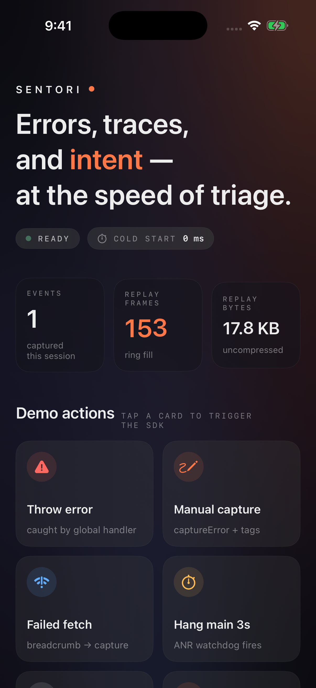
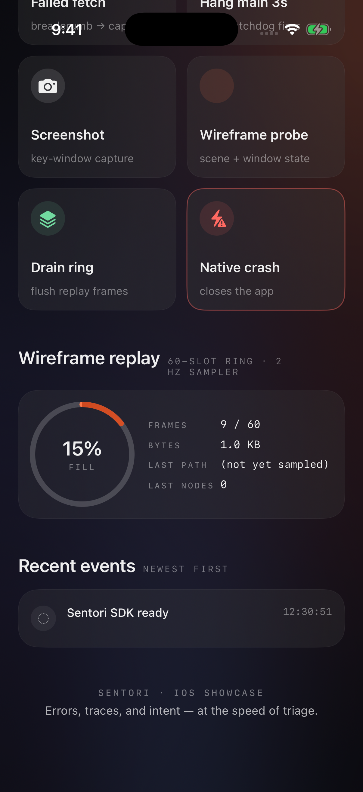

# Sentori

> Errors, traces, and **intent** — at the speed of triage.

RN-first error tracking, self-hostable. Sentori captures errors,
native crashes, hang stalls, and a **wireframe replay of the last
60 seconds** from React Native apps — and shows them in a dense
editorial-style dashboard plus a polished iOS SwiftUI showcase.



The pitch in one paragraph: Sentry's RN integration retrofits a
generic JS error tracker onto a native platform; mask rules and
deep-link APIs come second. Sentori is built RN-first — the iOS
crash handler, the wireframe replay sampler, the hang watchdog
and the mobile-vitals readout are all native Swift / Kotlin that
the JS layer exposes as one `sentori.captureException(...)` call.

---

## What's in the box

| | What | Where |
|---|---|---|
| 📡 | **SDK** | `sdk/react-native/` — `@goliapkg/sentori-react-native` (JS + iOS Swift + Android Kotlin via Expo Modules) |
| 🖥️ | **Dashboard** | `web/` — React 19 + Vite + Tailwind v4 SPA |
| 🚀 | **iOS showcase** | `apps/ios-showcase/` — SwiftUI 6 / iOS 26 native demo |
| ⚙️ | **Server** | `server/` — Rust + axum 0.8, PostgreSQL 18, Valkey |
| 🔧 | **CLI** | `cli/` — `sentori-cli` source-map upload (Rust) |
| 📚 | **Docs site** | `docs-site/` — Astro static site at `sentori.golia.jp/docs` |

---

## Try it in a simulator (60 s)

The SwiftUI showcase runs against the bundled Sentori native code
with no JS bridge — fastest way to feel what the SDK captures.

```sh
brew install xcodegen                  # one-time
git clone <this repo> && cd sentori
xcrun simctl create sim-sentori "iPhone 17 Pro" "iOS-26-4"
xcrun simctl boot sim-sentori

cd apps/ios-showcase
xcodegen generate
xcodebuild -project SentoriShowcase.xcodeproj \
  -scheme SentoriShowcase \
  -destination 'platform=iOS Simulator,name=sim-sentori' \
  -derivedDataPath build/ \
  CODE_SIGNING_ALLOWED=NO build

xcrun simctl install sim-sentori \
  build/Build/Products/Debug-iphonesimulator/SentoriShowcase.app
xcrun simctl launch sim-sentori jp.golia.sentori.showcase
```

What you'll see:

- live status pill (READY / BOOTING / OFFLINE) with pulse animation
- KPI strip — replay frames + bytes filling in real time as the
  wireframe sampler walks the view tree at 2 Hz
- demo grid — 8 cards, each triggers an SDK capability
  (throw / capture / fetch fail / hang main / native crash /
  screenshot / wireframe probe / drain ring)
- ring chart showing the 60-slot replay ring fill percentage
- recent events stream with SF Symbol icons + monospace timestamps



---

## Use it from a React Native app

```sh
bun add @goliapkg/sentori-react-native
cd ios && pod install --repo-update
```

```tsx
import { sentori } from '@goliapkg/sentori-react-native'

sentori.init({
  token: '<your project token>',
  release: 'my-app@1.2.3',
  environment: 'prod',
  ingestUrl: 'https://your.sentori.example',
  capture: { replay: { mode: 'wireframe', hz: 1 } },
})
```

Errors thrown anywhere in the JS layer, iOS `NSException`s, Android
uncaught exceptions, fetch-call-stack-of-failure breadcrumbs, native
crash files, and the wireframe replay ring are all flushed
automatically on `captureException`. No extra plumbing.

See `docs/sdk-react-native.md` for the full surface.

---

## Self-host the server + dashboard

```sh
cat > .env <<EOF
SENTORI_DEV_TOKEN=st_pk_dev0000000000000000000000
SENTORI_ADMIN_PASSWORD=changeme
SENTORI_SESSION_SECRET=$(openssl rand -hex 32)
SENTORI_PG_PASSWORD=$(openssl rand -hex 16)
SENTORI_ATTACHMENT_DIR=/var/lib/sentori/attachments
EOF

docker compose up -d
open http://localhost:8000
```

Sign in with `SENTORI_ADMIN_PASSWORD`. Full guide:
[`docs/self-hosting.md`](./docs/self-hosting.md).

---

## What's RN-first about it

- **Wireframe replay**, not raster session replay. 60 slots × ~120 bytes/frame at idle, gzip-friendly NDJSON. The dashboard renders SVG rects, not video; you can scrub through prop changes, not pixels.
- **Native screenshot + view-tree capture** under JS-supplied mask IDs. No `react-native-view-shot` peer dependency.
- **Hang watchdog** runs on a background dispatch queue on iOS and a separate thread on Android. JS layer sees it as one `captureException` with `kind: "anr"` when main blocks > 2s.
- **Mobile vitals** — `mach_absolute_time` cold start on iOS, `Process.getStartElapsedRealtime()` on Android. Slow + frozen frame counters via `CADisplayLink` / `Choreographer`.
- **`coerceError`** wraps native exceptions caught by the JS bridge with their full native stack, so a Swift `fatalError` in a TurboModule still shows up in the dashboard with the Swift frames intact.

---

## Roadmap

- **v0.1 – v0.9** — self-hostable single-binary baseline. Done.
  Capture / dashboard / source maps / privacy classifier / hang
  watchdog / mobile vitals / screenshot + view-tree + state /
  session trail / wireframe replay sampler.
- **v1.0** — Replay scrubber + fiber tree diff on the dashboard,
  intent-cluster view of breadcrumb paths, iOS showcase as the
  open-source front door. Tracking in
  [`docs/roadmap/v1.0.md`](./docs/roadmap/v1.0.md).
- **v2.0+** — Android showcase, distributed trace replay across
  RN → backend, AI-assisted root-cause hints.

---

## Stack

- **Backend** — Rust + axum 0.8 + PostgreSQL 18 + Valkey
- **Dashboard** — React 19.1 + Vite + Tailwind v4 + jotai + react-query
- **SDK** — `@goliapkg/sentori-react-native` for the published
  package; the native Swift / Kotlin code is reusable as a pod /
  Gradle module without the Expo wrapper (see `apps/ios-showcase/`
  for an example of using it directly)
- **CLI** — `sentori-cli` for source-map upload (Rust)
- **Showcase** — SwiftUI 6, iOS 26 deployment, MeshGradient +
  SF Symbol animations + Liquid Glass

---

## What v1.x explicitly does NOT do

- Sentry protocol compatibility (intentional — single-JSON
  camelCase wire format, no envelopes)
- Raster session replay (we do wireframe instead — smaller, no
  pixel-PII leak, RN-tree-native)
- Native signal-based crashes (SIGSEGV outside `NSException`)
- Multi-tenant SaaS billing (coming after v1.0)

See [`docs/roadmap/v1.0.md`](./docs/roadmap/v1.0.md) for the full
scope statement.

---

## License

TBD. See LICENSE.
